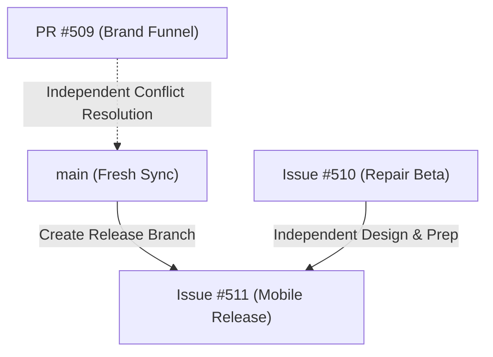

# Issue #511: [HC-MOBILE-RELEASE] Hermes Connect Public Beta — Web, iOS & Android

**Owner:** `Hermes Connect - Автономная Разработка`  
**Reviewer:** `Синхронизация Базы Знаний Агентов`  
**Status:** `IN_PROGRESS`  

---

## 1. Goal & Three-Phase Release Strategy
To bypass store funding constraints and immediately start collecting real user feedback without sacrificing the modular architecture, Hermes Connect is delivered following a three-phase distribution policy:

* **Phase 1: Direct Web & Standalone Package Release (CURRENT)**
  * **Web App:** Production website deployment at `hermeslogisticsus.com`.
  * **iPhone (iOS):** Standard Web App / PWA (Progressive Web App) home screen installation using the high-fidelity Safari Guided Installation simulator.
  * **Android:** Standalone signed Android APK file downloadable directly from the website.
* **Phase 2: App Store & Google Play Releases (DEFERRED FOR FUNDING)**
  * Uploading and publishing native Capacitor builds (`.ipa` / App Store, `.aab` / Google Play) as soon as developer account fees are funded.
* **Phase 3: Desktop Expansion (TRIGGERED AT ~10 REAL BETA USERS)**
  * Packaging and distributing standalone macOS and Windows desktop apps. (Do not start desktop development now).

---

## 2. Platform Release Matrix

| Platform | Distribution Channel | Current Status | Notes / Truth Boundaries |
| :--- | :--- | :---: | :--- |
| **Web** | Production Web App | `LIVE` | Operating at `hermeslogisticsus.com` |
| **iPhone PWA** | Web-based Home Screen Install | `IN_PROGRESS` | Uses high-fidelity Safari Guided Install simulator. |
| **Android APK** | Direct Web Download (.apk) | `NOT_STARTED` | **TRUE BOUNDARY:** Allowed to be directly downloadable from our website. |
| **Android AAB** | Google Play Store Build (.aab) | `NOT_STARTED` | Built and verified locally, but actual store submission is deferred. |
| **App Store** | Official Apple App Store | `DEFERRED` | Postponed until official Apple Developer account is funded. |
| **Google Play** | Official Google Play Store | `DEFERRED` | Postponed until official Google Developer account is funded. |
| **macOS** | Desktop Standalone App | `NOT_STARTED` | Phase 3 Expansion (Trigger: ~10 real active beta users). |
| **Windows** | Desktop Standalone App | `NOT_STARTED` | Phase 3 Expansion (Trigger: ~10 real active beta users). |

---

## 3. Release Policy & Monetization (FREE Public Beta)
> [!IMPORTANT]  
> All public customer pricing, subscriptions, Starter/Pro/Enterprise plans, and payment requirements are **DEFERRED** (marked internally as `MONETIZATION DEFERRED — CEO APPROVAL REQUIRED`).
> 
> The app is positioned and structured as **Free Public Beta** / **Free early access**. No user payment credentials or card details shall be requested during onboarding or workspace interactions.
> 
> **CRITICAL TRUTH BOUNDARY:**
> * Direct download of Android `.apk` files directly from our web pages is fully supported.
> * iOS `.ipa` files **must NOT** be advertised as general web downloads, as standard public iOS Safari users cannot install native iOS packages directly from web links. iPhone users will be routed exclusively to Web/PWA installation.

* **Onboarding Path:** Register ➔ Choose Business Type ➔ Direct entry into Workspace.
* **Badges & CTAs:** Primary CTAs updated to `Start Free Beta` / `Open Hermes Connect`.
* **Store Configuration:** 
  * App Store: `Price = Free`
  * Google Play: `App = Free`

---

## 4. Native App Utility (Deferred for Phase 2 Store Release)
To eventually comply with Apple App Store Guideline 4.2 (Minimum Functionality) in Phase 2, the future native wrapping must support rich user utility beyond a simple website wrapper. (This is NOT a blocker for Phase 1 PWA / Android APK):

* **Offline Shell & State:** Graceful transition to offline mode when network connection is lost. Persistent UI states so the app stays functional.
* **Local Persistence:** Local workspace state cached securely across reboots using persistent client-side storage.
* **Native Share:** Integration of the native share dialog (`@capacitor/share`) for sharing documents, diagnostics, and reports.
* **Native Haptics:** Subtle tactile haptic feedback (`@capacitor/haptics`) triggered on successful critical actions.
* **Deep Links & Universal Links:** Direct navigation from inbound URLs to specific app modules.
* **Mobile Navigation:** High-fidelity fixed-bar bottom navigation (`.mobile-nav`) with reliable stacking context and pointer-event interception safeguards.

---

## 5. Platform Specifications & Build Prerequisites

### A. Apple iOS Build (DEFERRED FOR PHASE 2)
* **Status:** `DEFERRED` (Not required for Phase 1 release).
* **Toolchain:** Xcode 26+ and iOS 26 SDK or later (required only for native App Store Connect listing).
* **Identifier (Bundle ID):** `com.hermeslogistics.connect` (**PROVISIONAL** - must be audited and verified against the official Apple Developer account first in Phase 2).
* **Aesthetics:** High-priority eager LCP image preloads, native status bar color synchronization (Pearl Light / Obsidian Dark), viewport-safe layout boundaries, and proper keyboard-avoidance behavior.

### B. Android Google Play Build (APK Active for Phase 1 / AAB Deferred)
* **Status:** `ACTIVE` for direct `.apk` distribution; `DEFERRED` for Play Store `.aab` publication.
* **Target SDK:** Android 16 / API Level 36.
* **Identifier (Package ID):** `com.hermeslogistics.connect` (**PROVISIONAL** - must be audited and verified against the Google Play Console in Phase 2).
* **Artifact:** Standalone signed Android `.apk` file for direct, secure download from the website.
* **Aesthetics:** Custom Adaptive Icon with background/foreground layers, standard splash screen API, and hardware Back Button interception/navigation handling.

---

## 6. Workstream Links & Relations

* **PR #509 (Brand Funnel):** Currently conflict-blocked. The implementation owner must resolve conflicts in an isolated, clean branch before merging.
* **Issue #510 (Repair Shop Pilot) & #511 (Mobile Release) Autonomy:** Active development of the Repair booking system, direct APK building, and PWA simulation **must NOT be held up** by PR #509. Design, component styling, and local testing can proceed safely in parallel, isolated checkouts.

---

## 7. Store Prerequisites & Account Audit (DEFERRED FOR PHASE 2)

| Platform | Prerequisite Element | Required Action / Status |
| :--- | :--- | :--- |
| **Apple** | Developer Membership | `DEFERRED` - Confirm active status (Organization or Individual) post-funding. |
| **Apple** | App Store Connect App | `DEFERRED` - Create listing, configure Bundle ID, configure App Privacy, Support & Marketing URLs. |
| **Apple** | Signing & Team | `DEFERRED` - Register signing certificate, provisioning profile, and configure Xcode signing. |
| **Google** | Play Console Account | `DEFERRED` - Identify developer account type (Organization or Personal). |
| **Google** | Play 14-day Tester Clock | `DEFERRED` - If a new personal account (post Nov 13, 2023), Closed Testing with 12 opted-in testers for 14 continuous days is required in Phase 2. *Does not block Phase 1 APK direct website download.* |
| **Google** | Play Console Draft | `DEFERRED` - Set up store listing draft, Content Rating, Data Safety form, and upload AAB. |

---

## 8. Quality Gate (Phase 1 Readiness)

| Priority | Classification | Description / Criteria |
| :---: | :--- | :--- |
| **P0** | **Release Blocker** | App crashes on launch, broken core guest booking, paywalls or upgrade prompts visible (must be FREE), missing Privacy Policy, broken Support URL. |
| **P1** | **Beta Fix (Post-Release)** | Minor visual layout shifts, cosmetic alignment on specific mobile viewports, offline cache optimization. *Do not block initial web/APK/PWA direct release.* |
| **P2** | **Improvement** | Non-critical feature enhancements, advanced telemetry reports, expanded transition animations. |

---

## 8. Feedback Loop & Analytics Compliance
* **Controlled Non-PII Telemetry:** GA4 analytics tracking must utilize distribution sources: `web`, `ios_app`, or `android_app`.
* **Zero PII Exposure:** Personal user details (name, email, exact location, phone number) or raw sales rep codes must **never** be transmitted to GA4.
* **Private Feedback Loop:** User feedback text (free-text entries regarding usability or missing features) must go to a secure, private receiver/storage path, completely bypassed from public analytics streams.
