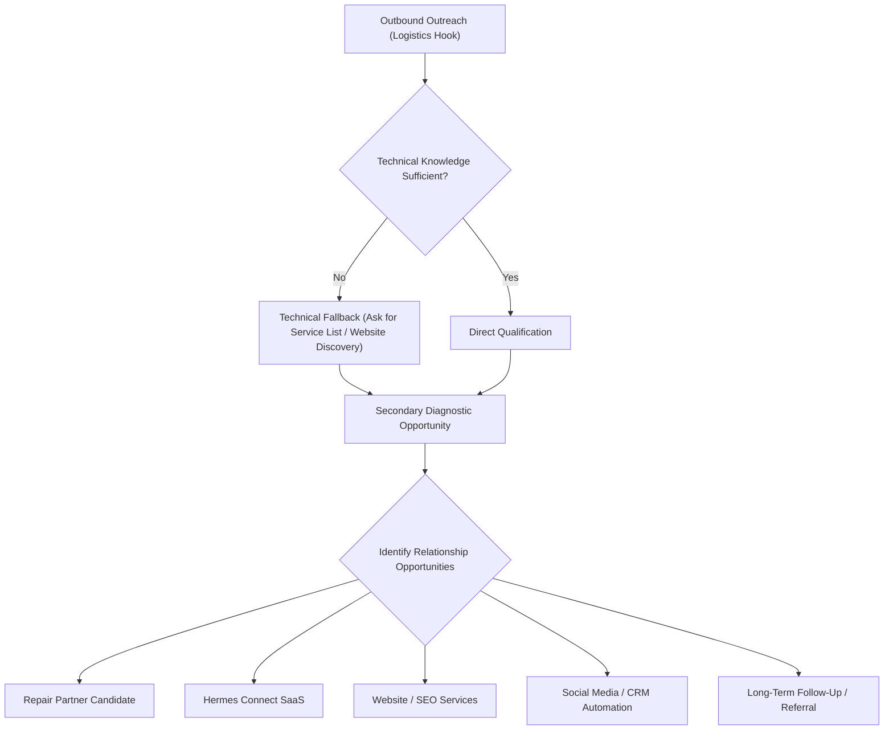

# SPECIFICATION: [HC-REPAIR-BETA] Repair Shop / Truck Repair Partner Pilot

**Status:** `APPROVED SPECIFICATION`  
**Date:** 2026-08-14  
**Primary Implementation Owner:** `Hermes Connect - Автономная Разработка`  
**Technical Reviewer / Sync Owner:** `Синхронизация Базы Знаний Агентов`  
**Final Reviewer & Approver:** Vladimir (CEO)  

---

## 1. Context & Business Model

Hermes Logistics outreach is the initial relationship hook. Sales reps contact U.S. repair shops, truck repair shops, parts suppliers, and adjacent businesses while Hermes builds and reviews a database of potential repair/service partners for trucks connected with the Hermes ecosystem.

Initial engagement is conducted using a multi-outcome relationship pipeline. The objective is to establish a durable connection rather than rushing into immediate monetization.



### Initial Diagnostic Questions:
1. *Do you work with the specific truck/equipment types Hermes Logistics utilizes (e.g., Car Haulers, Hotshots, Box Trucks, Reefers)?*
2. *Do you provide corporate or fleet discounts?*
3. *Do you provide special rates or programs for companies sending drivers directly?*
4. *What repairs and services do you provide (e.g., mobile/roadside, heavy engine, trailer maintenance)?*

---

## 2. Sales Playbook (Natural & Conversational)

Reps must avoid sounding like robotic call centers. Tone must be warm, peer-to-peer, and consultative.

### Sales Flow Structure:
```
Entry Point / Hook ➔ Situation ➔ Guided Questions ➔ Problem ➔ Consequence ➔ Value ➔ Offer ➔ CTA ➔ Follow-Up
```

### Script Elements:

* **Opening / The Hook:**
  > *"Hi, I'm calling from the corporate partner-development side of Hermes Logistics. We're a nationwide freight transport network, and we are currently building and reviewing a database of repair shops and service partners that may be able to support trucks connected with the Hermes ecosystem in [State]."*

* **Situation / Guided Questions:**
  > *"We want to identify high-quality local facilities for potential future routing when our trucks or owner-operators are in your area. Do you guys specialize in heavy duty transport, commercial haulers, or light/medium hotshots? Do you have fleet programs or corporate rates?"*

* **Technical Fallback (When technical knowledge is insufficient):**
  > *[If the prospect asks deep diesel technical questions the rep cannot answer]*  
  > *"To be completely honest with you, I'm on the corporate partner-development side rather than the shop floor, so I'm still learning the finer technical specifications of complex diesel rigs. I'd love to review your full service list and equipment capacities. Is that something I can find on your website or social media profile?"*

* **Website / SEO / Social Media Discovery (The secondary diagnostic opportunity):**
  > *[If the website is slow, missing mobile optimization, or lacks active social presence]*  
  > *"I was looking over your website, and I noticed it takes a few seconds to load on mobile, and the booking form is a bit tricky to fill out on a phone. When drivers are broken down on the road, they need to find you instantly on their screens. We also help businesses improve how easily customers and drivers can find and understand their services online. Is your search visibility something you’ve actively looked at recently?"*

* **Hermes Connect Early Access Offer:**
  > *"For a select group of partner candidates, we are providing early access to Hermes Connect — our new central operational inbox. It allows you to manage incoming driver inquiries, coordinate repair estimates, send direct proposals, and track customer communication in one place. While it is in Beta, we are offering early registration and system access for free to our key partner candidates so you can test it out and help us shape the platform."*

* **Partner-Offer CTA:**
  > *"I’d like to register your shop as a Partner Candidate in our database and submit your details to our review board. While they look over the application, I can guide you through the Hermes Connect early-access workspace so you can set up a draft profile. Does that sound like a fair starting point?"*

* **Objections & Solutions:**
  * *Objection: "We don't need more customers, our bays are full."*  
    * *Response:* *"That’s the best problem to have! In that case, we're not just looking to send random volume; we're looking to establish a pre-approved commercial fleet relationship so that when we do have a breakdown nearby, we are already in your system as an approved corporate account."*
  * *Objection: "Is this going to cost me a commission or a monthly fee?"*  
    * *Response:* *"Right now, Hermes Connect is in early-access Beta, and there's no fee to register as a partner candidate. We want your honest feedback as we refine the platform. Any future commercial terms or partner economics will be finalized once the pilot phase is complete."*

* **Follow-Up & Monthly Feedback Loop:**
  * Schedule a brief monthly 10-minute check-in call to review platform ease-of-use, lead flow quality, and feature suggestions.

---

## 3. Hermes Connect Early Access Offer Policy

* **Adoption and Testing Focus:** The early-access program is strictly designed to build adoption, collect feedback, test live-market workflows, and build long-term relationships.
* **No Permanent Free Guarantees:** Do **not** promise permanent free access. State clearly that the platform is free during the Beta/pilot phase.
* **No Invented Pricing:** Do not make up future subscription pricing.
* **No Invented Commissions:** Do not commit to specific future transaction referral or commission fees. CEO intent is to preserve relationship attribution now and calculate compensation economics later.

---

## 4. Partner Truth & Legal Boundary

* **Registration = Partner Candidate only:** Submitting an offer or registering on the platform does **not** constitute becoming an approved Hermes Logistics partner.
* **No Volume Guarantees:** Hermes Logistics does not guarantee:
  - Truck or driver volume
  - Customer or lead volume
  - Weekly/monthly revenue
  - Job or repair referrals
  - Exclusive geographical territory
  - Future sales commissions
* **Explicit Status Workflow:**
  1. `REGISTERED` (Default upon registration)
  2. `OFFER_DRAFT` (Candidate saves corporate/fleet program draft details)
  3. `OFFER_SUBMITTED` (Candidate submits discount details)
  4. `UNDER_REVIEW` (Internal team reviews capacity, alignment, and equipment compatibility)
  5. `APPROVED_PARTNER` (Requires explicit human review and system approval)
  6. `NOT_SELECTED` (Terminated or archived candidate)

---

## 5. Data Model & Knowledge Schema

All stored partner details must be highly structured. Private commercial agreements, corporate rates, and discount metrics are **confidential** and must never be exposed to public analytics.

```json
{
  "$schema": "https://json-schema.org/draft/2020-12/schema",
  "title": "HermesConnectPartnerCandidate",
  "type": "object",
  "properties": {
    "partner_id": { "type": "string", "format": "uuid" },
    "business_name": { "type": "string" },
    "repair_subtype": { 
      "type": "string", 
      "enum": ["auto_repair", "truck_repair", "trailer_repair", "mobile_roadside", "parts_supplier", "detailing", "fleet_maintenance", "other_auto_service"] 
    },
    "state_code": { "type": "string", "minLength": 2, "maxLength": 2 },
    "services_offered": { "type": "array", "items": { "type": "string" } },
    "equipment_specialties": { 
      "type": "array", 
      "items": { 
        "type": "string", 
        "enum": ["car_hauler", "dry_van", "reefer", "flatbed", "step_deck", "power_only", "hotshot", "box_truck", "cargo_van_sprinter", "truck", "trailer", "other"] 
      } 
    },
    "corporate_program_status": { "type": "boolean" },
    "discount_available_pct": { "type": "number", "minimum": 0, "maximum": 100 },
    "has_mobile_roadside": { "type": "boolean" },
    "has_24_7_emergency": { "type": "boolean" },
    "website_url": { "type": "string", "format": "uri" },
    "social_profile_url": { "type": "string", "format": "uri" },
    "relationship_status": { 
      "type": "string", 
      "enum": ["REGISTERED", "OFFER_DRAFT", "OFFER_SUBMITTED", "UNDER_REVIEW", "APPROVED_PARTNER", "NOT_SELECTED"] 
    },
    "opportunity_types": { 
      "type": "array", 
      "items": { 
        "type": "string", 
        "enum": ["repair_partner", "hermes_connect", "website", "seo", "social_media", "paid_advertising", "crm_automation", "follow_up_only"] 
      } 
    },
    "follow_up_status": { "type": "string", "enum": ["PENDING_CONTACT", "CONTACTED", "FOLLOW_UP_SCHEDULED", "ONBOARDED", "CLOSED_LOST"] },
    "lead_source": { "type": "string" },
    "sales_rep_code": { "type": "string", "pattern": "^[A-Z]{2,4}-[0-9]{3}$" }
  },
  "required": ["business_name", "repair_subtype", "state_code", "relationship_status", "sales_rep_code"]
}
```

---

## 6. U.S. Territory Ownership System

The sales team divides the U.S. map and works systematically in a deterministic state-by-state, top-to-bottom/left-to-right traversal order to eliminate any overlap.

### State Territory Record Schema:
```json
{
  "state_code": "IL",
  "territory_owner_rep_code": "REP-204",
  "status": "ACTIVE_PROSPECTING",
  "prospecting_started": "2026-08-14T00:00:00Z",
  "last_activity": "2026-08-14T10:15:00Z",
  "next_review": "2026-09-14T00:00:00Z",
  "prospect_count": 42
}
```

### Deterministic All-50-States + DC Traversal Map sequence:
To ensure 100% complete systematic map coverage without any unnecessary overlap, reps use this strict order:

1. **Midwest Core:** Wisconsin (`WI`), Illinois (`IL`), Michigan (`MI`), Indiana (`IN`), Ohio (`OH`)
2. **Midwest Plains & Northern:** Minnesota (`MN`), Iowa (`IA`), Missouri (`MO`), North Dakota (`ND`), South Dakota (`SD`), Nebraska (`NE`), Kansas (`KS`)
3. **Great Lakes to Northeast Transition:** Pennsylvania (`PA`), New York (`NY`), New Jersey (`NJ`), Delaware (`DE`), Maryland (`MD`), District of Columbia (`DC`)
4. **New England:** Connecticut (`CT`), Rhode Island (`RI`), Massachusetts (`MA`), New Hampshire (`NH`), Vermont (`VT`), Maine (`ME`)
5. **Middle Atlantic & Upper South:** Virginia (`VA`), West Virginia (`WV`), Kentucky (`KY`), Tennessee (`TN`), North Carolina (`NC`)
6. **Southeast Transit Corridors:** South Carolina (`SC`), Georgia (`GA`), Alabama (`AL`), Mississippi (`MS`), Florida (`FL`)
7. **South Central Corridors:** Louisiana (`LA`), Arkansas (`AR`), Oklahoma (`OK`), Texas (`TX`)
8. **Mountain Corridor:** Montana (`MT`), Wyoming (`WY`), Colorado (`CO`), New Mexico (`NM`)
9. **Desert Southwest:** Arizona (`AZ`), Utah (`UT`), Nevada (`NV`)
10. **Pacific Coast Hubs:** California (`CA`), Oregon (`OR`), Washington (`WA`), Idaho (`ID`)
11. **Non-Contiguous Territories:** Alaska (`AK`), Hawaii (`HI`)

---

## 7. Sales Attribution & Confidentiality

* **Attribution fields:** Must be maintained through a secure, private `sales_rep_code` (e.g., `REP-101`) to trace relationships cleanly back to the originating salesperson.
* **Rep Identities:** Do **not** pass real salesperson names, salaries, or target commissions to public sitemaps, front-door code, or public analytics.
* **Policy Note:** All commission structures, percentages, and performance payouts are labeled clearly as: **COMMISSION POLICY: NOT YET FINALIZED**.

---

## 8. Cross-Direction Product Logic Matrix

Every AI agent and sales rep must use this unified framing when discussing the value proposition of Hermes Connect across the four canonical business directions:

| Direction | Focus / Target Audience | Hermes Connect Value Proposition |
| :--- | :--- | :--- |
| **Logistics** | Fleet Owners, Carriers, Owner-Operators, Repair Partners | Operational dispatch flow, interactive B2B load board, AI freight-rate negotiation, direct maintenance partner mapping. |
| **Marketing** | Small/Medium Service Businesses, Retailers, Agencies | Unified Command Center Inbox, client lead intake qualification, conversational CRM, instant ROI calculation, auto-generated proposals. |
| **Academy** | Students, Career Switchers, Dispatcher Candidates | Interactive simulation, roleplay training tools, load board scenarios, automated practice inbox evaluation. |
| **IT Development** | Enterprise Clients, Technology Partners | Central API integration platform, zero-dependency client logic, offline PWAs, custom CRM integrations, conversational AI brains. |

---

## 9. Analytics, Telemetry & Privacy

* **Strict Privacy Rules:**
  - **No second GA4/GTM installation.** All events must flow through the existing canonical dataLayer and event registry.
  - **NO PII TRANSMISSION:** Never send names, emails, phone numbers, exact physical addresses, private commercial discounts, specific partner rates, or sales rep names to public analytics.
  - **NO Attributions or Commissions in GA4:** Do **not** push `rep_code`, `discount`, `discount %`, or `corporate rate` variables to public trackers.
* **Approved Connect Telemetry Events:**
  - `connect_repair_partner_landing_view` (Attributes: `source_direction: "logistics"`)
  - `connect_repair_registration_start` (Attributes: `source_direction: "logistics"`)
  - `connect_repair_registration_complete` (Attributes: `source_direction: "logistics"`, `state_code: "[STATE]"`)
  - `connect_partner_offer_start` (Attributes: `source_direction: "logistics"`)
  - `connect_partner_offer_submitted` (Attributes: `source_direction: "logistics"`, `business_type: "auto_service"`, `business_subtype: "truck_repair"`, `state_code: "[STATE]"`, `module: "partner_offer"`, `cta_type: "submit"`)
  - `connect_repair_module_open` (Attributes: `source_direction: "logistics"`)

---

## 10. State Reconciliation & Warnings

* **Direction Integration Stale Statement:** Current repository files (specifically the default welcome statements) still contain references stating that *"Beauty & Wellness is the first active-development category."* This is now **stale**.
* **New Priority Alignment:** Repair Shops / Truck Repair Partner Beta is the **first focused outbound commercial pilot**.
* **Coexistence Rule:** Do **not** delete Beauty, Auto Repair, or other active verticals. They must coexist side-by-side, but all outbound outreach focus redirects immediately to the Repair Shop pilot.
* **Hermes Connect Exposure:** Currently, Hermes Connect is not promoted prominently from every sub-direction page. This will be addressed in a subsequent release to ensure discoverability.

---

## 11. Codex Sales Workbook Integration (Sales Bridge V1)

CEO has approved a specific daily integration boundary between outbound prospecting data and the Hermes Connect database to ensure seamless candidate routing without manual re-entry:

### A. Phase-1 Architecture (Read-Only Bridge)
* **Codex Sales Workbook:** Stored under `US_Repair_Shops_Sales_Intake_Vadym_Acheme.xlsx`.
* **Zero Write-Back Policy:** The sales workbook is the absolute authority for prospecting and pipeline calls. Hermes Connect must NEVER write back to or modify the Excel sheet.
* **No Schema Unification:** Stored data models remain decoupled in Phase-1. Full schema unification is deferred until pilot evidence is collected from 5–10 active shops per manager.
* **Daily Mirror Import:** A read-only daily bridge (once every 24 hours, typically after 18:00 CT / 02:00 Kyiv time) reads active prospects from the Codex workbook and mirrors/links them to Hermes Connect Repair Profiles.

### B. Logical Source Ownership
* **Codex Workbook (The Prospecting Source):**
  - Prospecting activity
  - Cold calls / Sales pipeline states
  - Assigned sales territories / corridor phases
  - Follow-up logs
* **Hermes Connect (The Product Layer):**
  - Deep partner profile metadata
  - Specific equipment specialties and capacities
  - Onboarding and training modules
  - Partner offer drafts/submissions
  - Reviews, usage telemetry, and driver feedback

### C. Matching Priority & De-duplication Logic
To prevent duplicate accounts when a sales rep registers an offline candidate who later onboards online, the daily mirror uses a strict sequential matching hierarchy:
1. **Direct Entry ID Matching:** Match by explicit unique identifier or lead intake form ID.
2. **Exact Google Maps URL Matching:** If Maps URL matches exactly, link the profile.
3. **Normalized Phone Key Matching:** Strip all non-numeric characters (e.g., symbols, spaces, parentheses, dashes) to produce a clean 10/11-digit Phone Key. If Phone Keys match exactly, link.
4. **Fuzzy Business Profile Matching:** Match by exact `Business Name + State + City`. If matched, set state to `NEEDS_REVIEW` (manual administrator approval required). **NEVER fuzzy auto-merge records directly.**

### D. Critical State Suppression Rules
* **Do Not Contact (DNC) Rule:** If the prospect is marked `Do Not Contact` or `DNC` in the Codex workbook, this acts as an absolute suppression flag. Their profile must never be imported, contacted, or activated in Hermes Connect.
* **Duplicate Hold Rule:** If marked with a `Duplicate Hold` flag, pause automatic profile generation until manual reconciliation occurs.
* **CRM Review = Ready Rule:** Represents data completeness only. It indicates the profile has all required fields populated, but does NOT grant automatic contact, partner, or import approval.

---

## 12. Coordination & Quality Control Checklist

Before the synchronization agent appends an entry to the AI handoff, they must review the implementation chat's HEAD against this business brief:

- [x] **No Automation Bypass:** Verify that `workspace.js` does not use `navigator.webdriver` or user-agent checks to skip onboarding. (Resolved in `fab64e3b`).
- [x] **Identical Behavior:** Ensure human visitors and automation see identical HTML, layout classes, and scripts. (Resolved in `fab64e3b`).
- [x] **Seeded Test State:** Verify non-onboarding tests pre-seed `localStorage.hermes_business_type` rather than bypassing the overlay. (Resolved in `fab64e3b`).
- [x] **Explicit Onboarding Coverage:** Verify that `tests/hermes-connect-onboarding.spec.ts` covers first-visit, viewport scaling, mobile visibility, value persistence, and deep-linking. (Resolved in `fab64e3b`).
- [x] **Privacy Check:** Ensure no private rate discounts or sales rep names are pushed to telemetry.
- [x] **Truth Check:** Ensure sitemaps do not claim guaranteed freight volumes or exclusive territory for candidates.
- [ ] **Sales Bridge V1 Compliance:** Verify that read-only daily imports follow matching hierarchy rules and zero-writeback policies.
- [ ] **Next Action Hand-Off:** Provide the clean green-light code to the implementation owner for the Repair Shop Pilot feature cycle.

